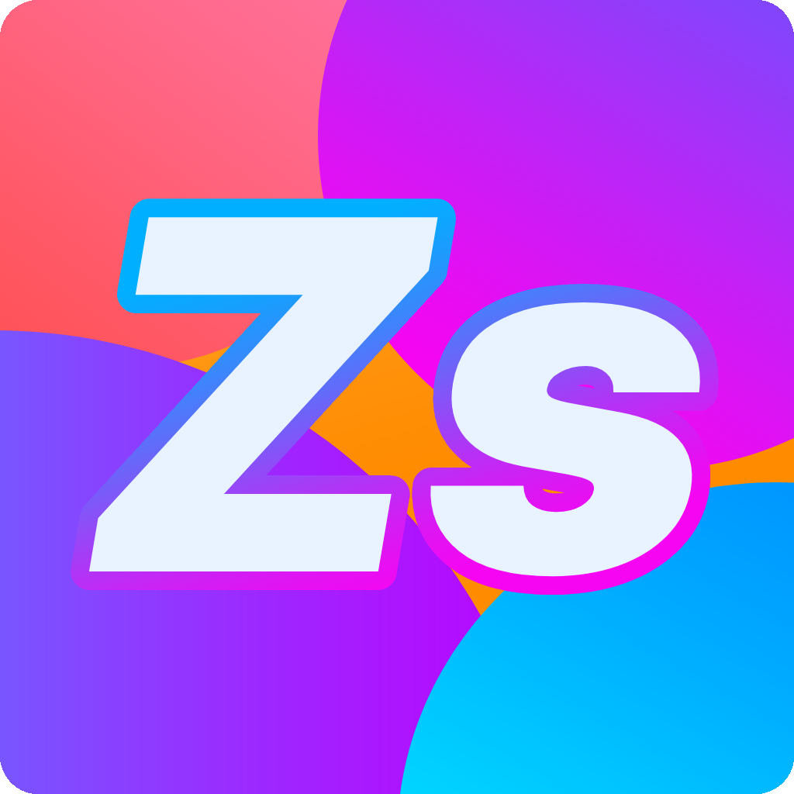

<h1 align="center">Zseblecke</h1>

<div align="center">

<br>
<br>
<h3>Mentsd el a házi feladataidat és kapj értesítseket róluk, hogy ne felejtsd el őket.</h3>
<a href='https://play.google.com/store/apps/details?id=com.szeligbalazs.zseblecke&pcampaignid=pcampaignidMKT-Other-global-all-co-prtnr-py-PartBadge-Mar2515-1'></a>
</div>

---

A Zseblecke alkalmazás a Coolest Projects Hungary 2022 második versenyére készült. Egy könnyen kezehető és személyre szabható leckefüzet alkalmazás.

Kettő főbb része van:

1. Naponta érteséítést küld az elkészítetlen házi feladatidról.
2. Menti és titkosítja az elmentett házi feladataidat.

Ha kíváncsi vagy, hogy hogyan kell használni appot, nézd meg a bemutatóvideóját.

<br>

<center>
    <h1><a href="https://www.youtube.com/watch?v=ZJaOuEDPLGI">Videó 📺</a></h1>
</center>

<br>

## Technikai háttér

Az alkalmazás a **Flutter** keretrendszerben készült **Dart** programozási nyelven. Az adatok eltárolásáról egy **SQL** adatbázis gondoskodik, ami az `sqflite` package-ben érhető el.
Dart package-ek, amiket az alkalmazás használ:

```yaml
sqflite: ^2.0.3
path_provider: ^2.0.11
path: ^1.8.1
shared_preferences: ^2.0.15
flutter_local_notifications: ^9.7.0
dart_date: ^1.1.1
timezone: ^0.8.0
```


## Hiba bejelentése

Ha hibát találtál az alkalmazásban, kérlek jelezd a Play Áruházban egy értékelés formájában.


<center>
    <h3>
        Köszönöm a figyelmet!
        <br>
        Szélig Balázs 2022
    </h3>
</center>